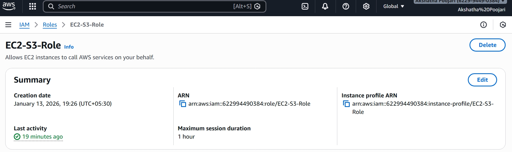

# Secure EC2 Web Server Deployment on AWS
This project demonstrates how to deploy a secure web server on AWS using Amazon EC2 within a custom VPC. 
The main focus is on network isolation, secure access control, and hosting a web application using Apache HTTP Server.
## 🛠️ Technologies Used
- AWS EC2
- Amazon VPC
- IAM (Roles)
- Security Groups
- Linux (Amazon Linux)
- Apache HTTP Server
## 🔄 Project Workflow
1. Created a custom VPC for network isolation.
2. Configured a public subnet with route table and Internet Gateway.
3. Launched an EC2 instance inside the public subnet.
4. Configured Security Groups to allow HTTP (80) and SSH (22).
5. Attached IAM Role to EC2 for secure AWS access.
6. Installed and configured Apache web server on Amazon Linux.
7. Accessed the hosted web page using the EC2 public IP.
## 📸 Project Screenshots

### VPC and Subnet Configuration

### EC2 Instance Running

### Security Group Rules

### IAM Role Attached

### Apache Web Server Output

## ✅ Outcome
- Successfully deployed a secure EC2-based web server.
- Implemented AWS best practices for security and access control.
- Gained hands-on experience with EC2, VPC, IAM, and Linux.
## 👩‍💻 Author
Akshatha Poojari  
AWS & Cloud Computing Learner
